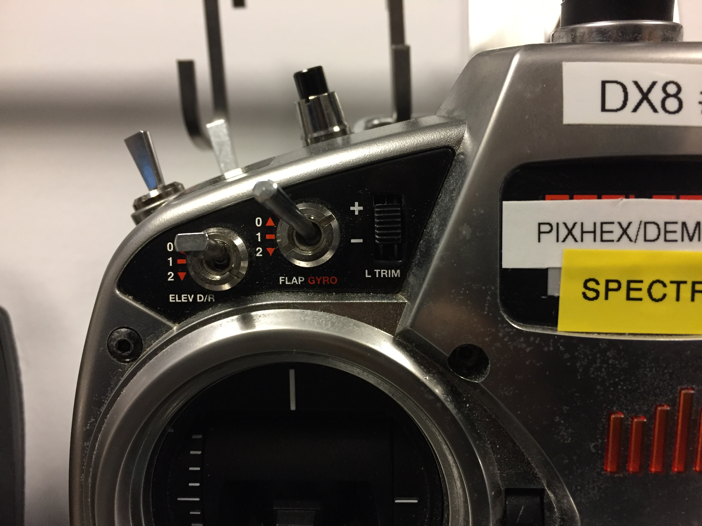

---
title: Controller Fixes
layout: template
filename: controller_fixes 
--- 

### My controller is vibrating and beeping at me
###### Flaps are low/high
The controller thinks that your rover is an airplane. That's okay.
There is no rover setting for the DX8s, so you'll just have to live with it.

When the DX8 controllers complain about your vehicle's non-existant flaps, they are referring to a certain input from this switch on your controller. 

On a normal airplane, this switch would control the flaps.

Flip this switch down all the way, to the lowest possible setting, before you turn your controller on. Afterwards, you are free to set them to whatever position you require. The DX8 controllers only check this switch's position once, when you turn on the controller.

*This page is under construction. Last edited 11/3/16*
