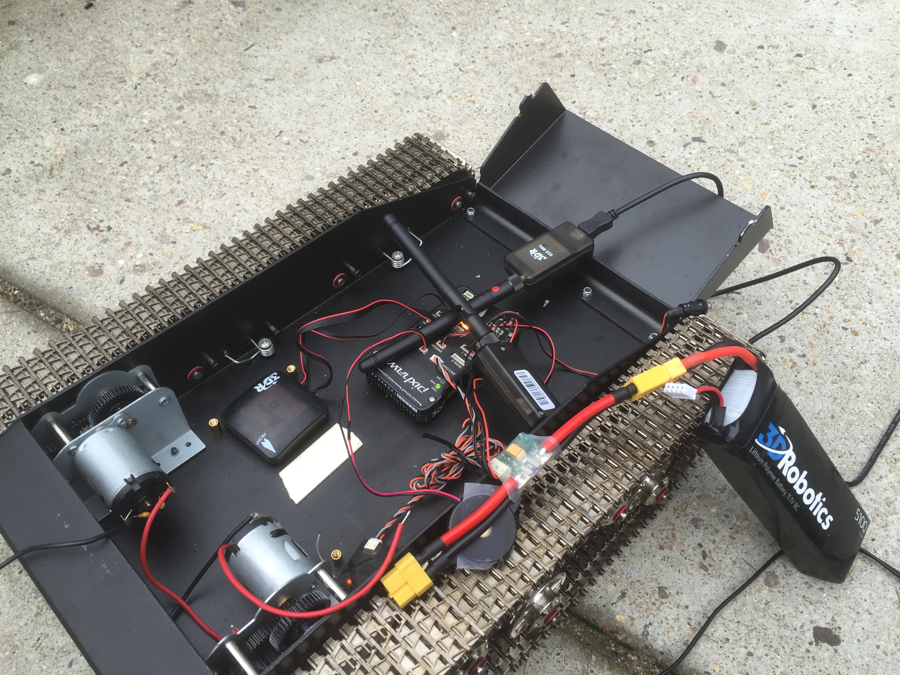
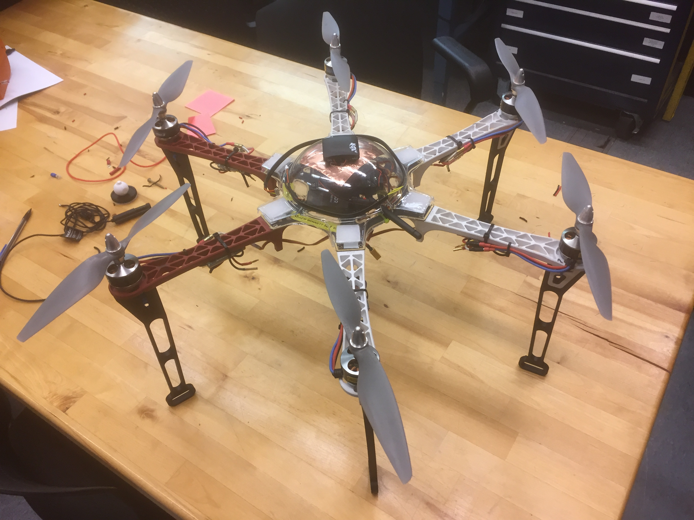
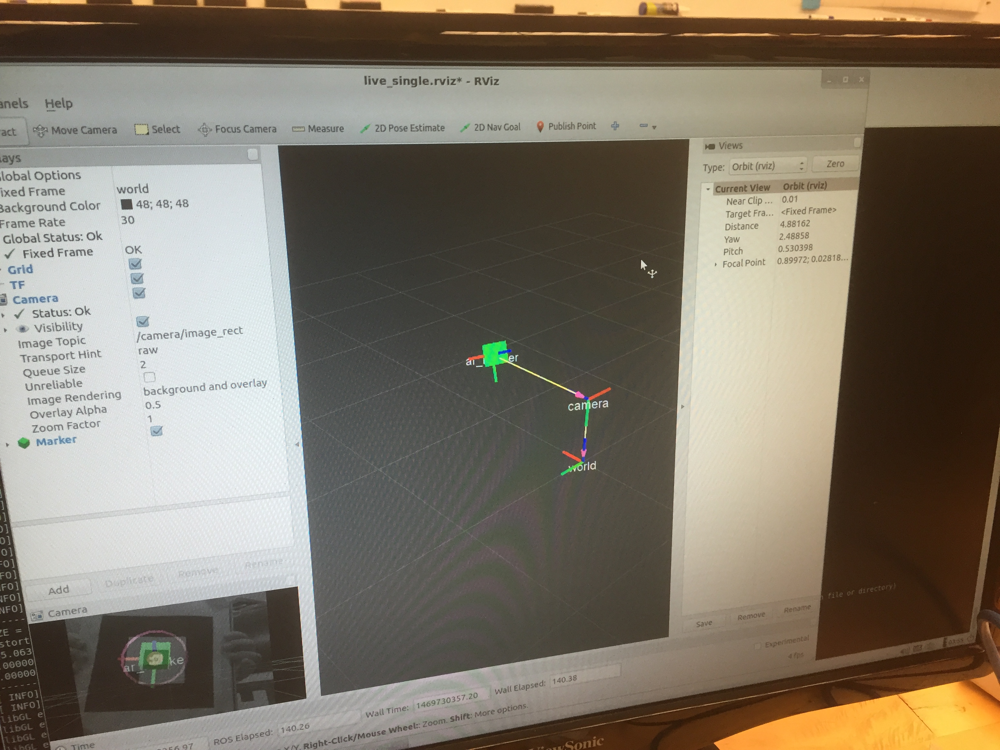

# Lavabot

Research in the Olin Intelligent Vehicles Lab, under Prof. Andrew Barrett. The end goal of this research is for a squadron of ground and air vehicles to communicate with each other in order to collect samples from hazardous environments fully autonomously.

## Meet our Robots!

#### Samwise: The Track T-Rex

### [Watch Sam drive](https://drive.google.com/file/d/0B6cEozG9ml5MSk1rZzdiLUs0TVE/view?usp=sharing)

#### Frodo: The F550 Flamewheel Hexacopter

## April Tag Recognition

April Tags are a system of visual fiducial tags used to encode information in small, easily detected patterns of squares.

*A series of April Tags. April Tags function similarly to QR codes, encoding short messages within the pattern of squares. Each April Tag can be read from any orientation, and can be used to determine the scanning camera's distance and orientation with respect to the tag.*

Our eventual goal is to use strategically placed April Tags to help our robots to navigate within their environment and with respect to each other. This will make more advanced maneuvers, such as landing our quadcopter on top of our ground vehicle, possible.

Our current fiducial detection system (AR_toolkit) is capable of tracking and detecting the orientation of AR codes, which are similar to QR codes and April Tags.

### [See our code in action](https://drive.google.com/file/d/0B6cEozG9ml5MRDA3VThmT3BteWM/view?usp=sharing)

## Tutorials and Troubleshooting

Always being updated as we encounter problems.

1. [Setting up Sam](Setup)
2. [Flying with Frodo](Setup)
3. [Control Issues (and Solutions)](Troubleshooting)

*This Github page is currently under construction. Last edited on 11/13/16.*
