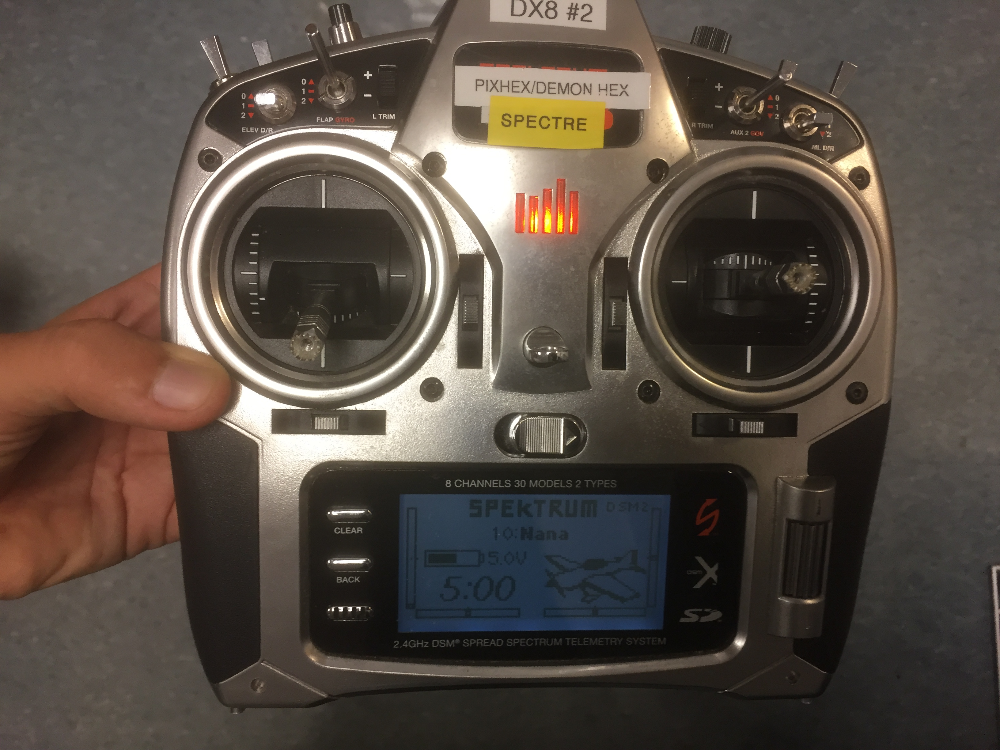
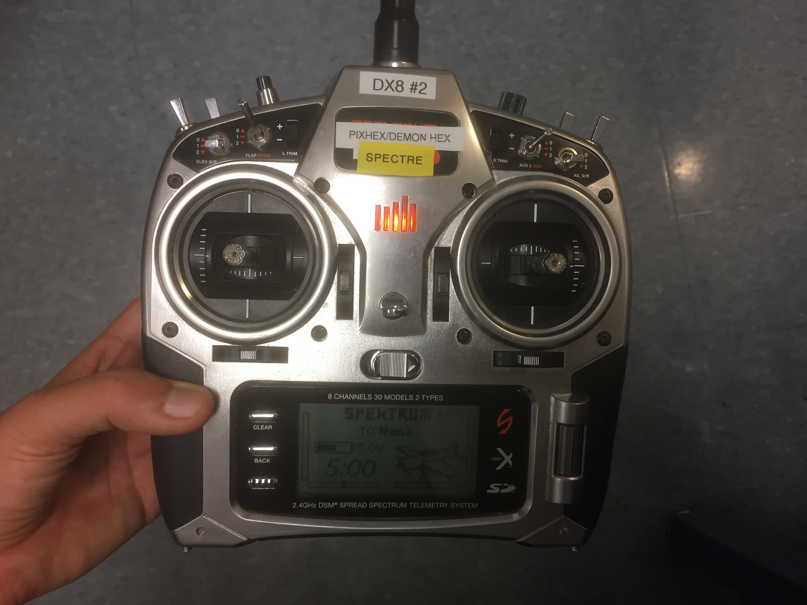

---
title: Setup
layout: template
filename: setup 
--- 

### Samwise Pre-drive Checklist

1. Double check the vehicle to make sure all wires are plugged in properly. At minimum, your vehicle should have...

  * Power from the battery to the Pixhawk flight controller and the Sabertooth motor controller
  * A transceiver
  * A safety switch
  * A buzzer

2. Check for loose components, especially near the motors and gear train.

3. Shake the vehicle or turn it upside down to check if anything comes loose. Secure any loose and dangling wires/components.

4. Turn on the controller, making sure that the left stick (throttle) is centered and down. Double check the screen to make sure you have selected the correct vehicle.

  * *[How do I change my currently selected vehicle?](https://drive.google.com/file/d/0B6cEozG9ml5MSk1rZzdiLUs0TVE/view?usp=sharing)*

  * *[My controller is complaining about flaps.](https://drive.google.com/file/d/0B6cEozG9ml5MSk1rZzdiLUs0TVE/view?usp=sharing)*

5. Center both sticks.

6. Plug in the vehicle's battery. The light on the Pixhawk should flash, and the buzzer will play a sequence of notes.

7. If you have telemetry equipment plugged into your Pixhawk, plug the paired telemetry unit into your computer's USB port. If this is the first time you're using this pair of telemetry radios on your computer, you will also have to install drivers.

8. Select the COM port you'll be using in the dropdown menu next to the Connect button, in the top right corner of Mission Planner. Then, click Connect.

9. Your parameters will now load.

10. Make sure your controller has been calibrated [here.](http://ardupilot.org/copter/docs/common-radio-control-calibration.html)
* Make sure your "flight" modes are set correctly, as shown [here.](http://ardupilot.org/copter/docs/common-rc-transmitter-flight-mode-configuration.html) Your main mode should be Manual or Learning, with your secondary mode being Auto, and your tertiary mode being Hold.
*[Read more about control modes for ArduRover here](http://ardupilot.org/rover/docs/rover-control-modes.html)*

11. Center both sticks.

*This page is under construction. Last edited 11/2/16*
